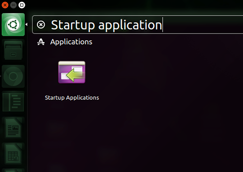
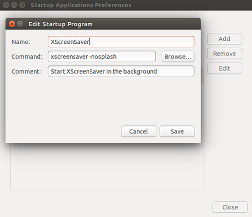
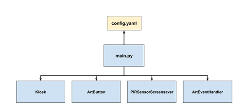

# Introduction
The purpose of this project is to build an AI art installation that uses machine learning to generate it's own art and display it to showcase.
## Summary
This guide goes through all the steps to build your own AI art installation, setting a timer to
change the AI artwork displayed on a screen. The main components used in this guide are:
 
* Raspberry Pi 3B+ or 4.
* Screen with HDMI support
* (Optional) Passive infrared sensor to reduce risk of screen burn-in

It includes how to set up the computer to run an art kiosk (with code) and PIR sensor etc.


# Table of content
1. [Prepare the computer]
    1. [Install operating system](#install-operating-system)
    2. [Install base requirements](#install-base-requirements)
2. [Install art kiosk](#install-art-kiosk)
3. [Add your generative code](#add-your-generative-code)
    1. [kiosk/arteventhandler.py](#kioskarteventhandlerpy)
    2. [main.py](#mainpy)

## Install base requirements
Update and upgrade apt-get

```
sudo apt-get update
sudo apt-get upgrade
```
If asked to choose between `gdm3` and `lightdm`, choose `gdm3`.

Reboot before continuing:

```bash
sudo reboot
```

After reboot, install pip3:

```bash
sudo apt install python3-pip
```

Install virtual environment:

```bash
sudo apt install -y python3-venv
```

Create a virtual environment in the directory `~/venvs` with the name `artkiosk`:

```bash
python3 -m venv ~/venvs/artkiosk
```

Activate the virtual environment:

```bash
source ~/venvs/artkiosk/bin/activate
```

Install python wheel:

```bash
pip3 install wheel
```

## Install xscreensaver (optional)
To reduce the risk of burn-in when displaying static art on the screen, a PIR (passive infrared) sensor was integrated. 
When no movement has been registered around the art installation, a screen saver was triggered.

The default screen saver on Ubuntu is `gnome-screensaver`. It's not a screen saver in the "traditional sense". Instead of 
showing moving images, it blanks the screen, basically shutting down the HDMI signals to the screen, enabling the screen to fall into low energy mode.

The screen I used in this project was a Samsung The Frame 32" (2020). When the screen was set to HDMI (1/2) and no HDMI 
signal was provided, it showed a static image telling the user that no HDMI signal is found. This is an unwanted behaviour in this set up, as we either 
wants the screen to go blank, or show some kind of a moving image, to reduce the risk of burn-in. We do not want to see 
a new static screen telling us that no hdmi signal is found.

To solve this problem, `xscreensaver` was installed instead. It's an alternative screen saver that support moving 
images. Also, it seems like `xscreensaver's` blank screen mode works differently than `gnome-screensaver`. When 
`xscreensaver's` blank screen is triggered, it doesn't seems to shut down the HDMI signal, but rather turn the screen 
black. This is the behaviour we want in this installation. 

If you're experiencing the same challenge as I did with the screen saver, follow these steps 
to uninstall `gnome-screensaver` and install `xscreensaver`:

```bash
sudo apt-get remove gnome-screensaver
sudo apt-get install xscreensaver xscreensaver-data-extra xscreensaver-gl-extra
```
After uninstalling `gnome-screensaver` and installing `xscreensaver`, it was added to `Startup Applications`:






Full installation guide: [https://askubuntu.com/questions/292995/configure-screensaver-in-ubuntu/293014#293014](https://askubuntu.com/questions/292995/configure-screensaver-in-ubuntu/293014#293014)

# Install art kiosk
We're now ready to install the art kiosk on the computer! 

Start by clone this repository:

```bash
git clone https://github.com/maxvfischer/DIY-ai-art.git
```

Change active directory and install the dependencies:

```bash
cd DIY-ai-art
pip3 install -r requirements.txt
```

The art kiosk is started by executing:

```bash
python3 -m main
```

NOTE: The art kiosk will **NOT** work properly if you don't attach the button and the PIR sensor. Please continue to 
follow the instructions.

The program running the art kiosk is written in `Python` 
and is running as 4 parallel processes, each implemented as its own class: `Kiosk`, `ArtButton`, `PIRSensorScreensaver` 
and `GANEventHandler`. The entry point is `main.py` and all the parameters used are defined in `config.yaml` (e.g. path to 
image directory, GPIO pinouts used etc).



| **Process/Class**              | **File**                   | **Description**                                                                                                                                                                                                                                                                                                                                                                                      |
|--------------------------------|----------------------------|------------------------------------------------------------------------------------------------------------------------------------------------------------------------------------------------------------------------------------------------------------------------------------------------------------------------------------------------------------------------------------------------------|
| **Kiosk**                      | kiosk/kiosk.py             |The `Kiosk` process handles all the GUI: toggling (\<F11>) and ending (\<Escape>) fullscreen, listens to change of the active artwork to be displayed etc.                                                                                                                                                                                                                                                                                                                                          
| **PIRSensorScreensaver**       | kiosk/pirsensorscreensaver |The `PIRSensorScreensaver` process listens to a GPIO pinout connected to a PIR sensor. When no motion has triggered the PIR sensor within a predefined threshold of seconds, the computer's screensaver is activated. When motion is detected, the screensaver is deactivated.                                              |
| **ArtEventHandler**            | kiosk/art_event_handler.py             |The `ArtEventHandler` process is listening to deleted items in the image directory. When the button is clicked and an image is deleted (i.e. moved to replace the active artwork file, active_artwork.jpg), this process checks how many images that are left in the image directory. If the number of images falls are below a predefined threshold, a new process (function) is spawned, generating a new set of images. You need to update this class to generate the images. |

# Add your generative code
You need to add your own generative code (GAN-network or others), by updating two files:

* kiosk/arteventhandler.py
* main.py

## kiosk/arteventhandler.py
The class `ArtEventHandler` found in the file `kiosk/arteventhandler.py` is an event handler that is triggered to generate new images to be saved in the image directory. When an image is deleted from the image directory (i.e. moved to replace the active artwork), `ArtEventHandler's` class function `on_deleted` is executed. It checks if the number of images found in the image directory is above or below a pre-defined threshold. If the number of images falls below the threshold, `ArtEventHandler's` class function `generate_images` is executed. It is in this function that you need to add your generative code that will add new images to the image directory.

## main.py
If you have updated `ArtEventHandler's` constructor with new arguments, you need to update the initialization of `ArtEventHandler` in the function `start_art_generator` found in `main.py`.
